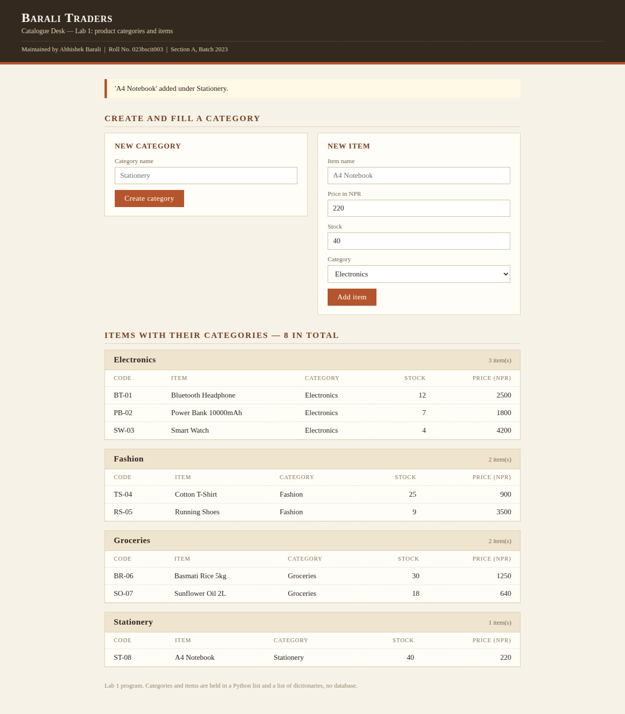
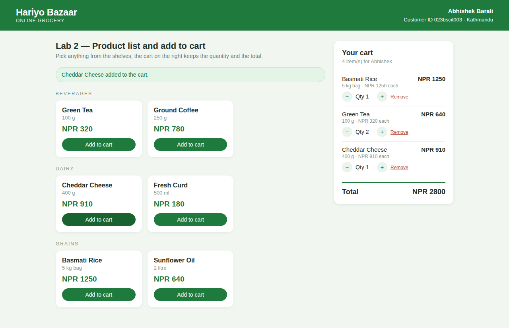
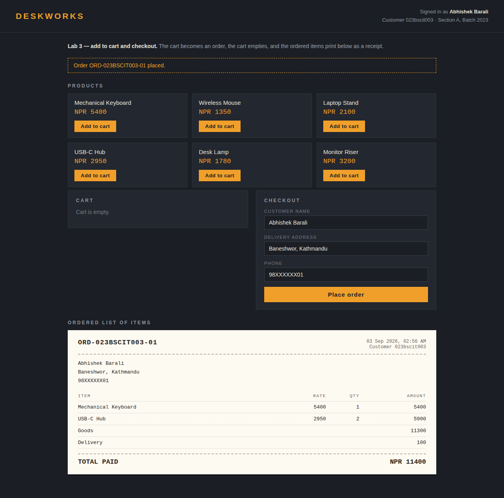
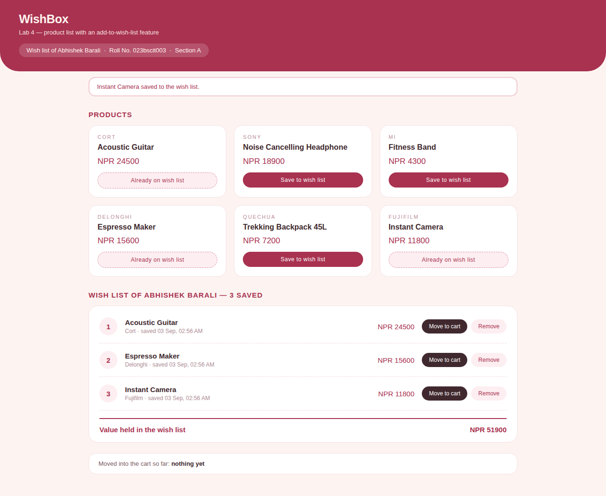
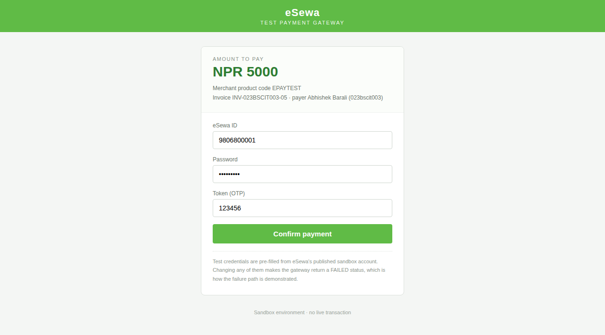
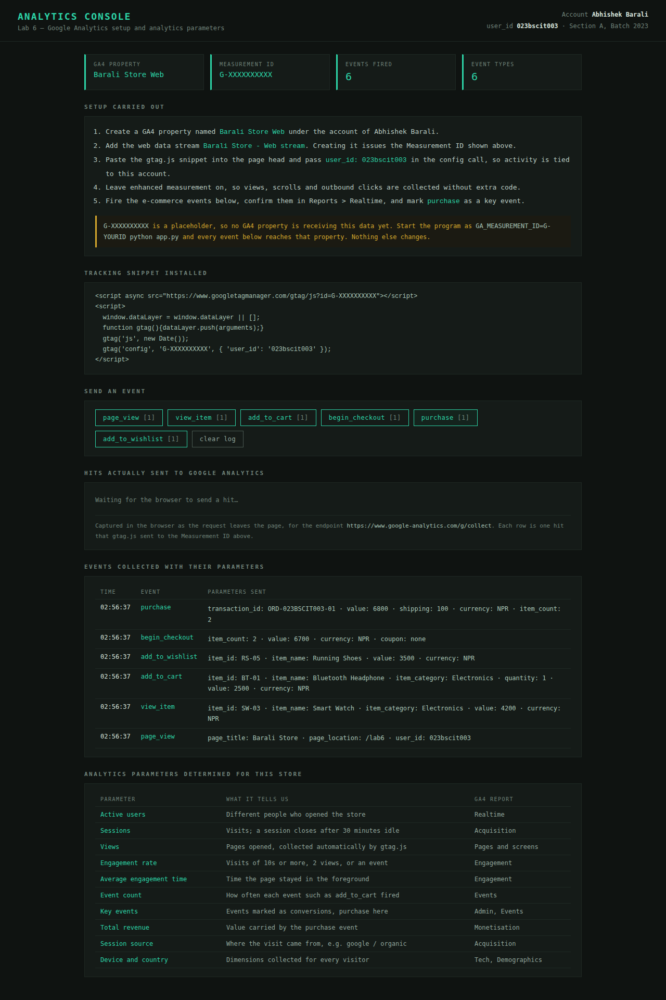

# E-Commerce Laboratory — Lab Programs 1 to 6

Six separate e-commerce programs, one per lab. Each lab has its own folder, its
own product data and its own interface, so any lab can be run and shown on its
own. Written in Python with Flask; records are kept in plain lists and
dictionaries, so no database is needed.

| Field | Value |
|---|---|
| Name | Abhishek Barali |
| Roll No. | 023bscit003 |
| Section | A |
| Semester / Batch | 2023 |

## The six programs

| Lab | Program | Folder | Port |
|---|---|---|---|
| 1 | Product categories and items — *Barali Traders* catalogue desk | `lab1_categories/` | 5001 |
| 2 | Product list and add to cart — *Hariyo Bazaar* grocery | `lab2_cart/` | 5002 |
| 3 | Add to cart and checkout — *DeskWorks*, prints an order receipt | `lab3_checkout/` | 5003 |
| 4 | Wish list — *WishBox* saved items | `lab4_wishlist/` | 5004 |
| 5 | Payment gateway — eSewa in sandbox (test) mode | `lab5_payment/` | 5005 |
| 6 | Google Analytics setup and analytics parameters | `lab6_analytics/` | 5006 |

## Run one lab

```bash
python3 -m venv .venv
.venv/bin/pip install -r requirements.txt

cd lab1_categories          # or any other lab folder
../.venv/bin/python app.py  # then open the port printed above
```

## Report

`docs/ECommerce_Lab_Report_Abhishek_Barali_023bscit003.docx` — objective, logic,
full source code and output screenshots for all six labs. Times New Roman 12pt,
black text, US Letter, 28 pages.

Rebuild it with:

```bash
.venv/bin/python tools/capture_screenshots.py   # runs all six apps, takes the screenshots
node tools/build_report.js                      # writes the .docx
```

## Screenshots

| Lab 1 — categories | Lab 2 — cart |
|---|---|
|  |  |

| Lab 3 — order receipt | Lab 4 — wish list |
|---|---|
|  |  |

| Lab 5 — sandbox gateway | Lab 6 — analytics console |
|---|---|
|  |  |

## Notes

- Lab 5 runs eSewa in test mode with its published sandbox credentials. No live
  merchant key is used and no real money moves. Changing any credential makes
  the gateway return `FAILED`, which demonstrates the failure path.
- Lab 6 sends real events. The GA4 `gtag.js` snippet is installed in the page
  head, each button hands its event to `gtag`, and the page lists every hit the
  browser sends to `google-analytics.com/g/collect` so the integration is
  visible without opening the GA dashboard.

## Lab 6 with a live Google Analytics property

The Measurement ID is read from an environment variable, so no code changes:

```bash
cd lab6_analytics
GA_MEASUREMENT_ID=G-ABCD123456 ../.venv/bin/python app.py
```

Creating the GA4 property needs the account owner to sign in to Google — that is
the one step nothing else can do for you. `docs/GA4-SETUP.md` has the
click-by-click steps (about two minutes), and the events then show up under
**Reports → Realtime**.

To check delivery without the dashboard:

```bash
.venv/bin/python tools/verify_analytics.py
```

It drives the page, clicks every event, and writes `docs/analytics_verification.txt`
listing each hit that left the browser. The last run captured 19 hits covering
`page_view`, `view_item`, `add_to_cart`, `add_to_wishlist`, `begin_checkout` and
`purchase`.
