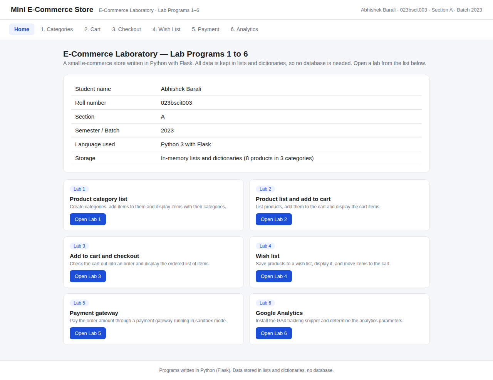
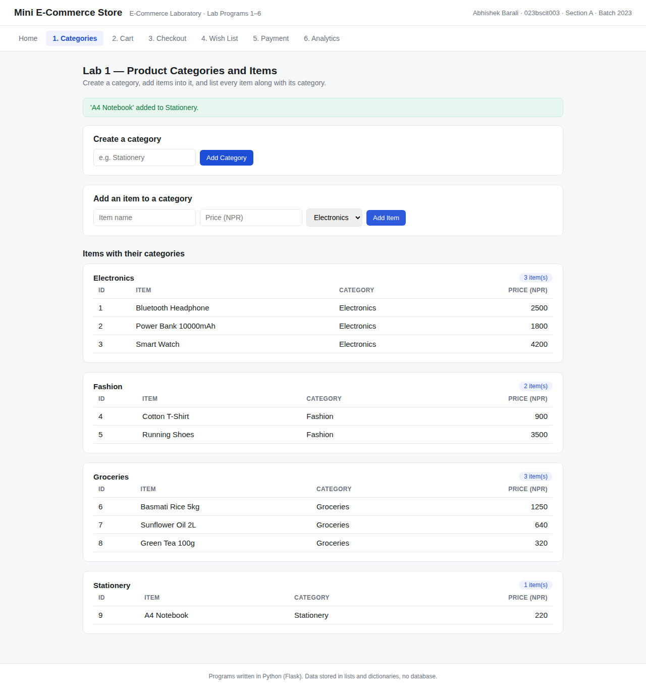
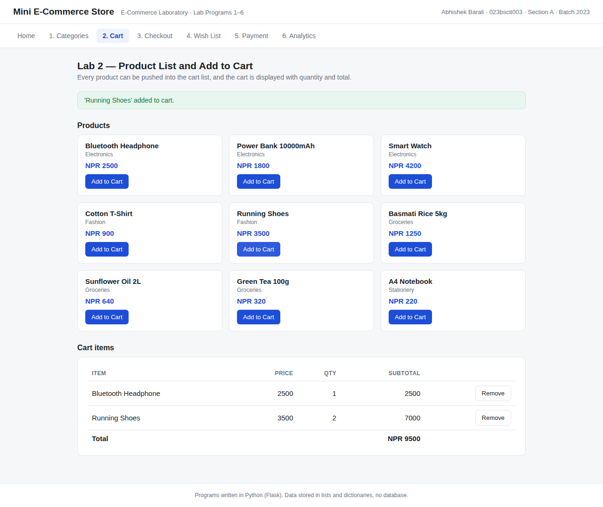
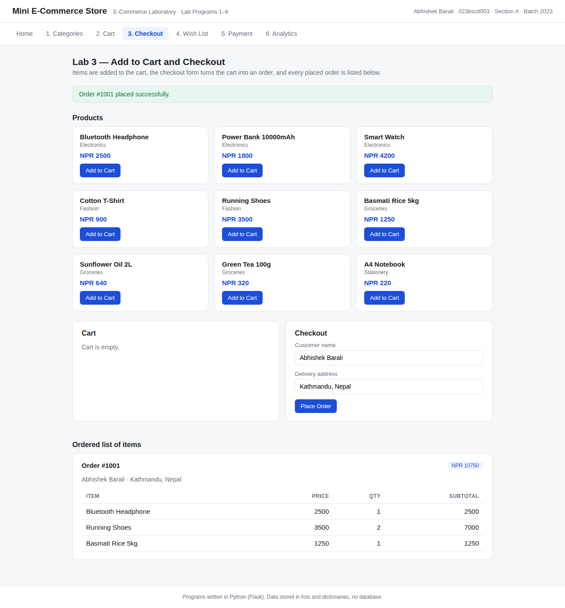
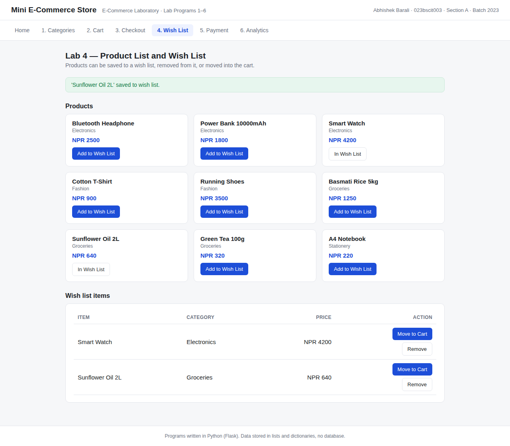
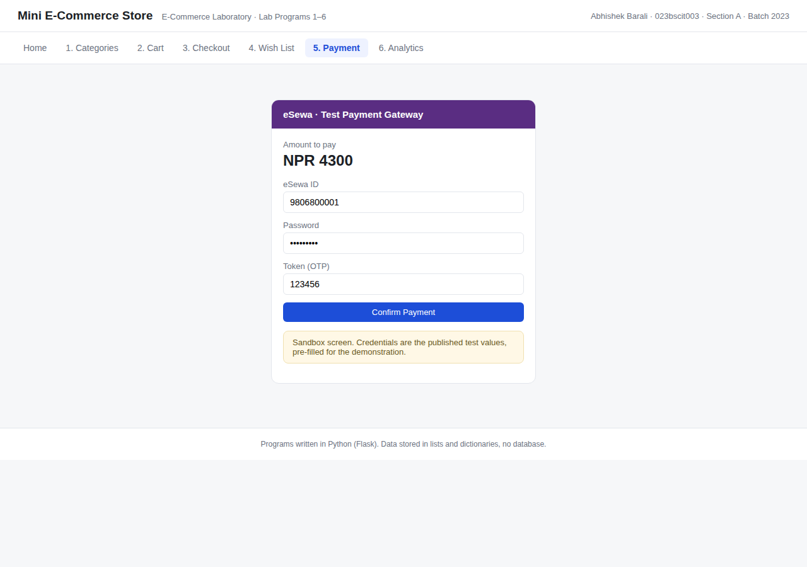
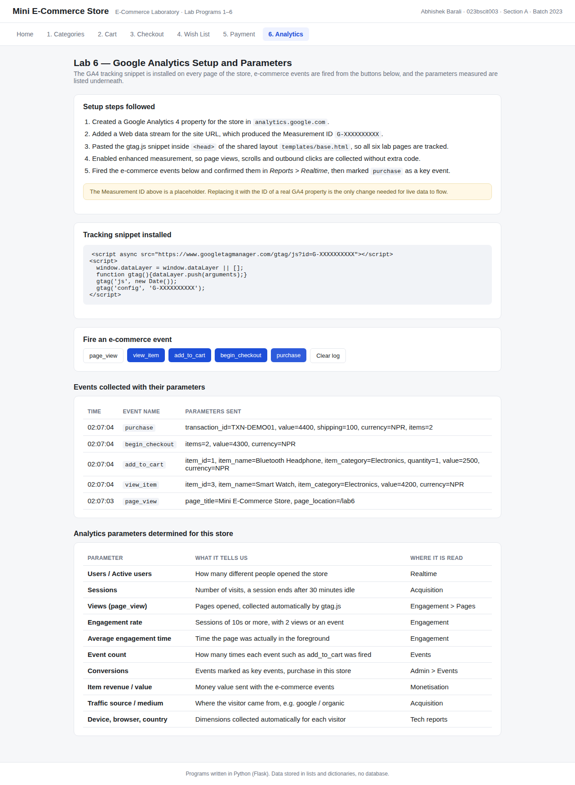

# E-Commerce Laboratory — Lab Programs 1 to 6

A mini e-commerce store that covers all six programs of the E-Commerce Laboratory
assignment. Written in Python with Flask. All data lives in plain lists and
dictionaries, so no database is needed.

| Field | Value |
|---|---|
| Name | Abhishek Barali |
| Roll No. | 023bscit003 |
| Section | A |
| Semester / Batch | 2023 |

## Labs covered

| Lab | Program | Page | Code |
|---|---|---|---|
| 1 | Product category list, add items to categories, display items with their categories | `/lab1` | `labs/lab1_categories.py` |
| 2 | Product list with add to cart, display cart items | `/lab2` | `labs/lab2_cart.py` |
| 3 | Add to cart and checkout, display the ordered list of items | `/lab3` | `labs/lab3_checkout.py` |
| 4 | Product list with wish list, display wish list items | `/lab4` | `labs/lab4_wishlist.py` |
| 5 | Payment gateway integration, eSewa in sandbox (test) mode | `/lab5` | `labs/lab5_payment.py` |
| 6 | Google Analytics setup and analytics parameters | `/lab6` | `labs/lab6_analytics.py` |

## Run it

```bash
python3 -m venv .venv
.venv/bin/pip install -r requirements.txt
.venv/bin/python app.py
```

Then open <http://127.0.0.1:5000>.

## Report

The full report with objectives, logic, code and output screenshots is in
`docs/ECommerce_Lab_Report_Abhishek_Barali_023bscit003.docx`.

## Screenshots

| Home | Lab 1 categories |
|---|---|
|  |  |

| Lab 2 cart | Lab 3 order placed |
|---|---|
|  |  |

| Lab 4 wish list | Lab 5 sandbox gateway |
|---|---|
|  |  |

| Lab 6 analytics events |
|---|
|  |

## Notes

- Lab 5 runs the payment gateway in test mode with the published eSewa sandbox
  credentials. No live merchant key is used and no real money moves.
- Lab 6 installs the GA4 `gtag.js` snippet in `templates/base.html` with a
  placeholder Measurement ID (`G-XXXXXXXXXX`). Swapping in a real Measurement ID
  is the only change needed for live data. The e-commerce events are also logged
  locally so the parameters being collected can be seen on the page.
- `tools/capture_screenshots.py` regenerates the screenshots and
  `tools/build_report.py` rebuilds the .docx report.
